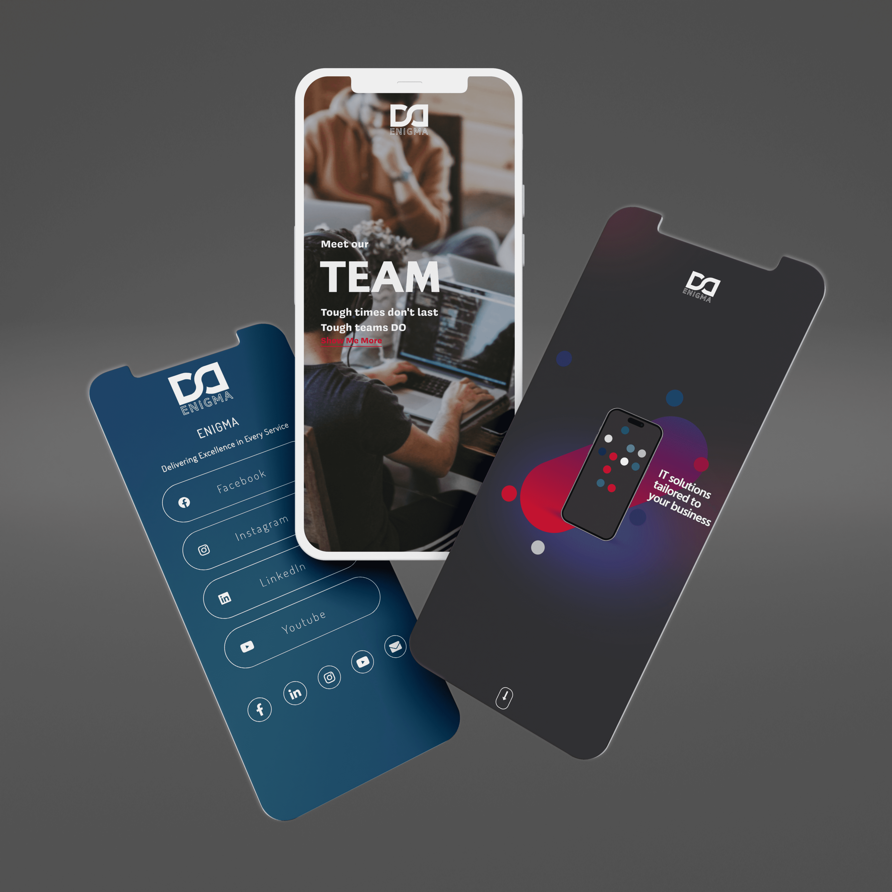

<p align="center">
    
</p>

# Enigma App

The Enigma App is a cutting-edge demonstration of Enigma's exceptional technological prowess and innovative solutions. Designed by our dedicated team of experts, this app showcases the limitless potential of our company's services.

## Preview

<details>
  <summary>Click to expand for more images</summary>
<div style="text-align:center;">
  <table style="margin: 0 auto;">
    <tr>
      <td> 
      </td>
      <td>
      </td>
    </tr>
  </table>
</div>

  
  

</details>

## Live Demo

🌐 Explore the live demo of the Enigma App: [**Live Demo**](https://example.com) <!-- Replace with the actual live demo URL -->

Feel free to interact with the app and experience its features in action.

**Disclaimer:** Please note that the actual source code for the Enigma App is classified and proprietary. This repository is a recreation of the app using web technologies for showcase and demonstration purposes only. It does not contain the complete or actual source code of the Enigma App.


## Table of Contents

- [Overview](#overview)
- [Tech Stack](#tech-stack)
- [Features](#features)
- [Getting Started](#getting-started)
- [Contributing](#contributing)
- [License](#license)

## Overview

The Enigma App is a testament to our commitment to pushing the boundaries of technology. It serves as a showcase of Enigma's innovative solutions and exceptional technological expertise. The app's user-friendly interface and powerful features highlight the endless possibilities our company offers.

## Tech Stack

### Frontend:

- 
- 
- 
- 

### Platform:

- 
- 


### Language:

- 
- 
- 

### Backend:
- 


## Features

- **Cutting-Edge Technology:** Experience the latest technological innovations integrated into the Enigma App.
- **Immersive 3D Graphics:** Dive into immersive 3D graphics powered by Three.js.
- **User-Friendly Interface:** Navigate through the app effortlessly with a user-friendly interface.
- **Innovative Solutions:** Discover innovative solutions that showcase Enigma's expertise.

## Getting Started

To get started with the Enigma App, follow these steps:

1. Clone this repository to your local machine.

   ```bash
   git clone https://github.com/yourusername/Enigma-App.git
   ```

2. Install the necessary dependencies.

   ```bash
   npm install
   ```

3. Run the app on your Android device or emulator.

   ```bash
   npm run android
   ```

4. Explore the app and enjoy the experience.


## Contributing

We welcome contributions to improve the Enigma App. If you'd like to contribute, please follow these guidelines:

1. Fork the repository.
2. Create a new branch for your feature or fix.
3. Make your changes and commit them.
4. Push your changes to your fork.
5. Submit a pull request to the main repository.

## License

This project is licensed under the [MIT License](LICENSE.md) - see the [LICENSE.md](LICENSE.md) file for details.
